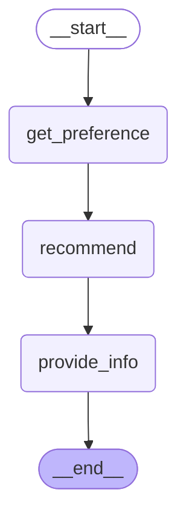
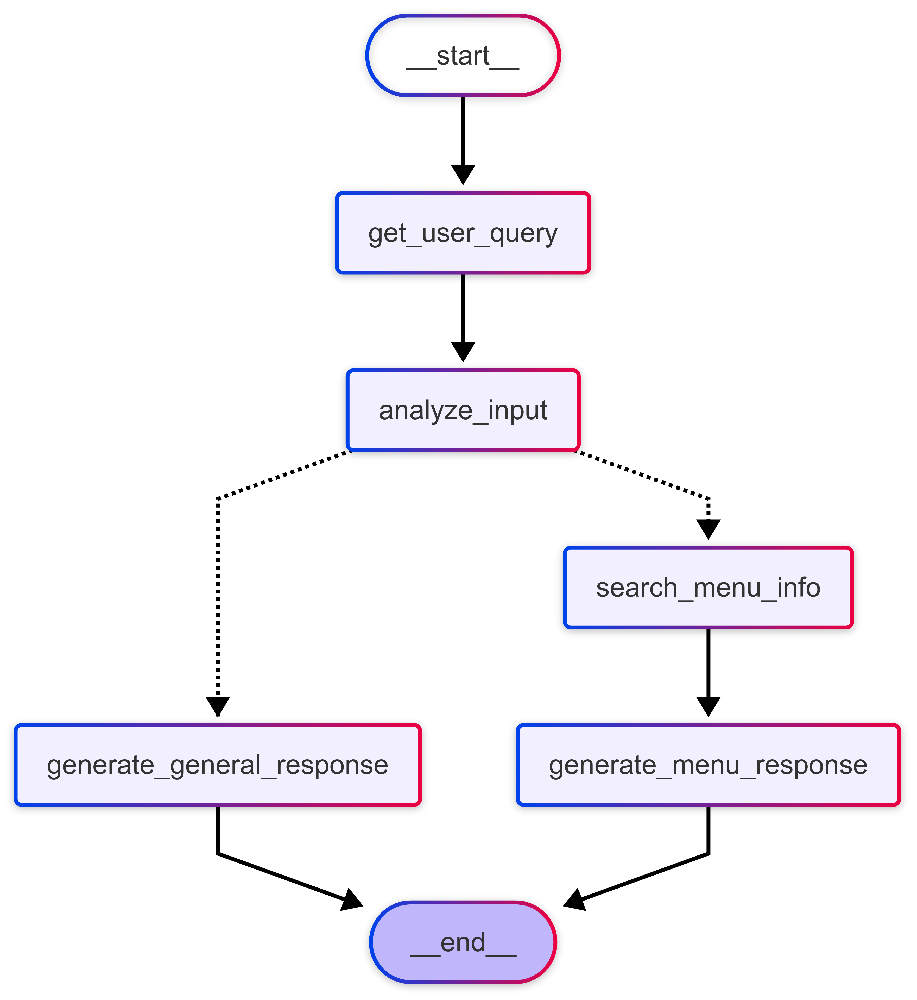
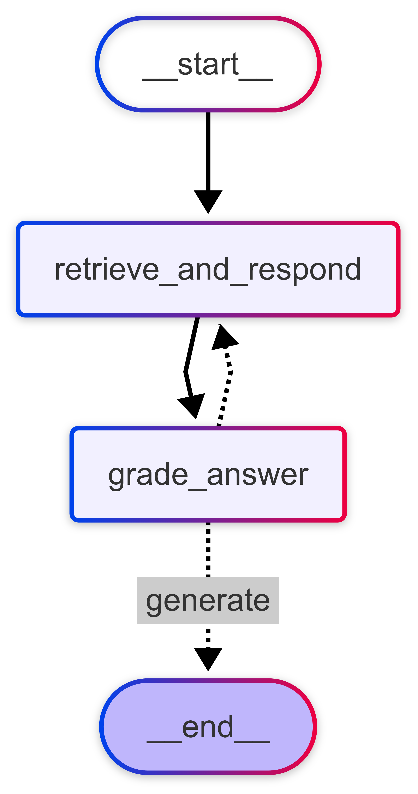

## StateGraph 개요
정의: state를 기반으로 작동하는 그래프 구조 <br>
목적: 복잡한 작업 흐름을 상태 & 전이로 모델링하여 **유연하고 제어 가능한 시스템**을 구축 <br>
특징: 각 노드가 특정 상태를 나타내며, 엣지가 생타간 전이의 조건을 정의
1. 상태:
- 정의: 애플리케이션의 현재 스냅샷을 나타내는 공유 데이터 구조
- 특징: 
- - 주로 TypeDict | Pydantic BaseModel을 사용
- - 시스템의 전체 context를 포함
2. 노드:
- 정의: Agent의 로직을 Encoding하는 Python function.
- 특징:
- - 현재 state를 입력으로 받음.
- - 계산이나 부작용을 수행함.
- - 업데이트된 State를 반환.
3. 엣지:
- 정의: 현재 State를 기반으로 다음에 실행할 node를 결정하는 함수
- 특징:
- - 조건부 분기 or 고정 전이
- - 시스템의 흐름을 제어

```python
#그래프의 전체 상태(노드 간 공유되는 공용 상태)
class OverallState(BaseModel):
    text: str
#node 함수
def node(state:OverallState):
    return {"text":"안녕하세요!"}

#그래프 구축(엣지로 연결)
builder = StateGraph(OverallState)
builder.add_node(node) #첫 번째 노드
builder.add_edge(START, "node") #그래프는 노드로 시작
builder.add_edge("node", END) #노드 실행 후 그래프를 종료
graph = builder.complile()
```


## 조건부 엣지를 활용한 분기
정의: 현재 상태나 입력에 따라 다음 노드를 동적으로 결정하는 연결 <br>
목적: 시스템의 흐름을 더 유연하고 상황에 맞게 제어 <br>
특징: 조건문을 사용하여 다음 실행할 노드를 선택

```python
def decide_next_step(state: MenuState):
    if state['is_menu_related']:
        return "search_menu_info"
    else
        return "generate_general_response"

builder.add_conditional_edges(
    "analyze_input",
    decide_next_step,
    {
        "search_menu_info" : "search_menu_info",
        "generate_general_response": "generate_general_response"
    }
)

```

## 조건부 엣지 함수로 분기 구현하기
노드 정의하기
- TypedDict: 딕셔너리의 타입을 정적으로 명시, API 응답 혹은 JSON 객체 등의 딕셔너리 행텨의 데이터 구조를 명확히 정의
- List: 리스트의 원소를 명시적으로 정의
- Literal: enum처럼 변수에 정해진 값만 허용
```python
from typing import TypedDict, List

class MenuState(TypedDict):
    user_query: str
    is_menu_related: bool
    search_results: List[str]
    final_answer:str
llm = ChatOpenAI(model="gpt-4o-mini")

def get_user_query(state:MenuState) -> MenuState:
    user_query = input("무엇을 도와드릴까요? ")
    return {"user_query" : user_query}

def analyze_input(state:MenuState) -> MenuState:
    analyze_template = """
    사용자의 입력을 분석하여 레스토랑 메뉴 추천이나 음식 정보에 관한 질문인지를 판단하세요.
    사용자 입력:{user_query}
    레스토랑 메뉴나 음식 정보에 관한 질문이면 "True", 아니면 "False"로 답변하세요.
    답변:
    
    """
    analyze_prompt = ChatPromptTemplate.from_template(analyze_template)
    analyze_chain = analyze_prompt | llm | StrOutputParser()
    
    result = analyze_chain.invoke({"user_query": state['user_query']})
    is_menu_related = result.strip().lower() == "true"
    return {"is_menu_related" : is_menu_related}

def search_menu_info(state: MenuState) -> MenuState:
    results = vector_db.similarity_search(state['user_query'], k=2)
    search_results = [doc.page_content for doc in results]
    return {"search_results":search_results}

def generate_menu_response(state: MenuState) -> MenuState:
    response_template = """
    사용자 입력: {user_query}
    메뉴 관련 검색 결과: {search_results}
    
    위 정보를 바탕으로 사용자의 메뉴 관련 질문에 대한 상세한 답변을 생성하세요.
    검색 결과의 정보를 활용하여 정확하고 유용한 정보를 제공하세요.
    
    답변:
    """
    response_prompt = ChatPromptTemplate.from_template(response_template)
    response_chain = response_prompt | llm | StrOutputParser()
    
    final_answer = response_chain.invoke(
        {
            "user_query":state['user_query'],
            "search_results":state["search_results"],
            
        },
    )
    print(f"\n메뉴 어시스턴트: {final_answer}")
    return {"final_answer" : final_answer}

def generate_general_response(state: MenuState) -> MenuState:
    response_template = """
    사용자 입력: {user_query}
    
    위 입력은 레스토랑 메뉴나 음식과 관련이 없습니다.
    일반적인 대화 맥락에서 적절한 답변을 생성하세요.
    
    답변:
    """
    response_prompt = ChatPromptTemplate.from_template(response_template)
    response_chain = response_prompt | llm | StrOutputParser()
    final_answer = response_chain.invoke({"user_query": state["user_query"]})
    print(f"\n일반 어시스턴트:{final_answer}")
    return {"final_answer":final_answer}     
```

```python
from langgraph.graph import StateGraph, START, END

builder = StateGraph(MenuState)

builder.add_node("get_user_query", get_user_query)
builder.add_node("analyze_input", analyze_input)
builder.add_node("search_menu_info", search_menu_info)
builder.add_node("generate_menu_response", generate_menu_response)
builder.add_node("generate_general_response", generate_general_response)

builder.add_edge(START, "get_user_query")
builder.add_edge("get_user_query", "analyze_input")

builder.add_conditional_edges(
    "analyze_input", #현재 노드
    decide_next_step, #분기를 결정할 함수
    {
        "search_menu_info" : "search_menu_info", #조건값 -> 이동할 노드
        "generate_general_response" : "generate_general_response"
    }
)

builder.add_edge("search_menu_info", "generate_menu_response")
builder.add_edge("generate_menu_response", END)
builder.add_edge("generate_general_response", END)

graph = builder.compile()
```


## State Reducer
- 정의: **상태 업데이트**를 관리하는 함수
- 목적: 그래프의 각 노드의 출력을 **그래프의 전체 상태에 통합**하는 방법을 정의
- 동작 방식
- - 각 노드의 반환값은 해당 상태 키의 이전 값을 **덮어쓰기** 저장(기본 리듀서)
- - 메시지 리스트 등에서 이전 상태에 새로운 값을 추가할 때 사용(add 리듀서)
- - 중복 제거, 정렬 등 특수한 상태를 관리하는 사용자 정의 리듀서 지원(custom 리듀서)

### Reducer를 별도로 지정하지 않은 경우
- 상태를 덮어쓰는 방식으로 작동하기 때문에 documents의 상태가 최근 업데이트에만 의존한다.
```python
class DocumentState(TypedDict):
    query: str
    documents: List[str]
```
### Reducer를 별도로 지정하는 경우
- 상태를 추가하는 방식으로 작동하기 때문에 documents의 상태가 이전의 업데이트에서 계속해서 추가된다.
- 챗봇 시스템 내에서 `chat history`가 필요하여 상태를 유지해야할 경우 사용한다.
```python
class ReducerState(TypedDict):
    query: str
    documents: Annotated[List[str], add]
```

### Reducer를 사용하지 않은 경우
```python
class DocumentState(TypedDict):
    query: str
    documents: List[str]
```
```최종 상태: {'query': '채식주의자를 위한 비건 음식을 추천해주세요', 'documents': ['doc2.pdf', 'doc4.pdf', 'doc5.pdf']}```
### Reducer를 사용한 경우(add)
```python
from operator import add
from typing import Annotated, TypedDict
class ReducerState(TypedDict):
    query: str
    documents: Annotated[List[str], add]
```
```최종 상태: {'query': '채식주의자를 위한 비건 음식을 추천해주세요', 'documents': ['doc1.pdf', 'doc2.pdf', 'doc3.pdf', 'doc2.pdf', 'doc4.pdf', 'doc5.pdf']}```
### Reducer를 사용한 경우(Custom)
```python
from typing import TypedDict, List, Annotated

def reduce_unique_dociments(left: list | None, right: list | None) -> list:
    """_summary_
    Combine two lists of documents, removing duplicates.
    Args:
        left (list | None): _description_
        right (list | None): _description_

    Returns:
        list: _description_
    """
    if not left:
        left = []
    if not right:
        right = []
    return list(set(left + right))

class CustomReducerState(TypedDict):
    query: str
    documents: Annotated[List[str], reduce_unique_dociments]
```
```최종 상태: {'query': '채식주의자를 위한 비건 음식을 추천해주세요', 'documents': ['doc3.pdf', 'doc4.pdf', 'doc1.pdf', 'doc2.pdf', 'doc5.pdf']}```

## MessageGraph 개요
- 정의: LangChain의 ChatModel을 위한 특수한 형태의 StateGraph
- 특징: Mseeage 객체 목록(HumanMessage, AIMessage 등)을 입력으로 처리
- 목적: 대화 기록을 효과적으로 관리하고 활용할 수 있음(자연스러운 대화 흐름, 컨텍스트 활용 답변)

### Messages State 정의
1. 대화 기록을 그래프 상태에 메시지 목록으로 저장
2. Message 객체 목록을 지정하는 messages 키를 추가
3. 이 키에 reducer를 추가하여 메시지 업데이트를 관리
- - `operator.add`: 새 메시지를 기존 목록에 단순히 추가
- - `add_messages`: 기존 메시지 업데이트 처리(메시지의 ID를 추적하는 기능)
```python
from typing import Annotated
from langchain_core.messages import AnyMessage
from langgraph.graph.message import add_messages

class GraphState(TypedDict):
    messages: Anonotated[list[AnyMessage], add_messages]
```
```python
from langgraph.graph import MessagesState
from typing import List
from langchain_core.documents import Documents
class GraphState(MessagesState):
    documents: List[Document]
    grade: float
    num_generation: int
```
### 주의사항
- 메모리 관리: 대화 기록이 길어질 경우 오래된 메시지를 제거하는 로직을 추가
- 프라이버시: 민감한 정보가 포함된 메시지는 적절하게 처리
- 성능 최적화: 메시지 처리 로직이 복잡해질 경우 성능의 최적화가 필요.

### 조건부 엣지를 활용 반복(iteration/ Feedback Loop)
- 조건부 엣지를 활용하여 반복적인 작업을 수행하는 그래프
- 평가 결과를 바탕으로 다시 응답을 생성하는 과정이 반복
- `grade_answer`에서 `retrieve_and_respond`로 돌아가는 구조는 피드백 루프를 형성
```python
def should_retry(state: GraphState):
    if state['graph'] < 0.7:
        return "retrieve_and_respond"
    else:
        return "generate"

builder.add_conditional_edges(
    "grade_answer",
    should_retry,
    {
        "retrieve_and_respond": "retrieve_and_respond",
        "generate":END
    }
)
```

```python
'''
이전 사람의 메시지 기반으로 반응을 만들어냄
'''
def retrieve_and_respond(state: GraphState):
    last_human_message = state['messages'][-1]
    query = last_human_message.content
    
    retrieved_docs = retriever.invoke(query)
    response = rag_chain.invoke(query)
    return{
        "messages" :[AIMessage(content=response)],
        "documents": retrieved_docs
    }
```

```python
from  pydantic import  BaseModel, Field
'''
스키마 정의
'''
class GradeResponse(BaseModel):
    "A score for answer"
    score: float = Field(..., ge=0, le=1, description="A score from 0 to 1, where 1 is perfect")
    explanation: str = Field(..., description="An explanation for the given score")
'''
답변의 품질을 평가하는 노드
이전의 question과 context, answer를 바탕으로 grade를 결정하고, 그 grade가 일정 기준 이하라면 다시 iter.
총 iter의 수를 제한하여 무한 루프로 빠지는 것을 방지.
'''
def grade_answer(state: GraphState):
    messages = state['messages']
    question = messages[-2].content
    answer = messages[-1].content
    context = format_docs(state['documents'])
    
    grading_system = """You are an expert grader.
    Grade the following answer based on its relevance and accuracy to the question, condsidering the given context.
    Provide a score from 0 to 1, where 1 is perfect, along wit an explatnation
    """
    grading_prompt = ChatPromptTemplate.from_messages({
        ("system", grading_system),
        ("human", "[Question]\n{question}\n\n[Context]\n{context}\n\n[Answer]\n{answer}\n\n[Grade]\n")
    })
    grading_chain = grading_prompt | llm.with_structured_output(schema=GradeResponse)
    
    grade_response = grading_chain.invoke({
        "question": question,
        "context": context,
        "answer": answer
    })
    
    num_generation = state.get('num_generation', 0)
    num_generation += 1
    return {"grade": grade_response.score, "num_generation":num_generation} 
```
그래프 구성
```python
from typing import Literal

def should_retry(state: GraphState) -> Literal["retrieve_and_respond", "generate"]:
    print("--Gradting--")
    print("Grade Score: ", state['grade'])
    
    if state["num_generation"] > 2:
        return "generate"
    
    if state["grade"] < 0.7:
        return "retrieve_and_respond"
    else:
        return "generate"
builder = StateGraph(GraphState)
builder.add_node("retrieve_and_respond", retrieve_and_respond)
builder.add_node("grade_answer", grade_answer)

builder.add_edge(START, "retrieve_and_respond")
builder.add_edge("retrieve_and_respond", "grade_answer")
builder.add_conditional_edges(
    "grade_answer",
    should_retry,
    {
        "retrieve_and_respond":"retrieve_and_respond",
        "generate": END
    }
)
graph = builder.compile()
```

```python
initial_state = {
    "messages": [HumanMessage(content="채식주의자를 위한 메뉴를 추천해주세요")],
}
final_state = graph.invoke(initial_state)
print("최종 상태: ", final_state)
```