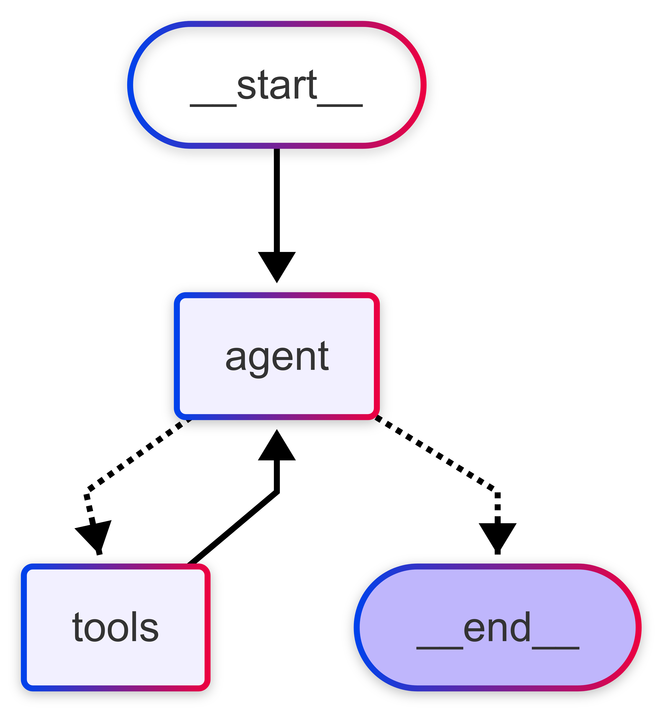
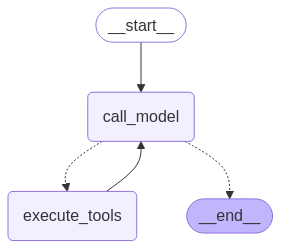

## ReAct
- 정의: 추론(Reasoning)과 행동(Acting)을 결합한 접근 방식
- 목적: LLM이 단순히 텍스트를 생성하는 것을 넘어, 환경과 상호작용하면서 복잡한 작업을 수행

### ReAct 동작 방식
1. 행동:
- - 모델이 주어진 상황을 분석하고 적절한 도구를 선택
- - 선택한 도구를 호출하고 필요한 입력을 제공
2. 관찰:
- - 호출된 도구의 실행 결과나 출력을 모델에 다시 전달
- - 에이전트가 자신의 행동 결과를 이해/학습
3. 추론:
- - 이전 단계의 관찰 결과를 분석하여 다음 행동을 결정
- - 다른 도구를 호출하거나, 또는 직접 응답을 생성
- - 현재 상황을 평가하고, 최선의 다음 단계를 선택 <br>
`추론과 행동의 반복적인 사이클을 통해 복잡한 작업을 단계적으로 해결`


### Tool & ToolNode 설정
```python
from langgraph.prebuilt import ToolNode

tool_node  = ToolNode(tools=tools)

tool_call = llm_with_tools.invoke([HumanMessage(content=f"스테이크 메뉴의 가격은 얼마인가요?")])

results = tool_node.invoke({"messages" :[tool_call]})

```


### LangGraph 내장된 ReAct 에이전트 생성

`create_react_agent`
- 가장 쉽게 ReAct 에이전트를 생성하는 방법
- 주요 단계:
- 1. 필요한 라이브러리 임포트
- 2. 언어 모델 설정
- 3. 도구 정의
- 4. ReAct 에이전트 생성
- 5. 에이전트 실행
```python
from langgraph.prebuilt import create_react_agent

graph = create_react_agent(
    llms,
    tools = tools,
    state_modifier=system_prompt
)
inputs = {"messages": [HumanMessage(content="스테이크 메뉴의 가격은 얼마인가요?")]}
messages = graph.invoke(inputs)
```

### StateGraph 구조를 사용하여 ReAct 에이전트 만들기

#### 조건부 엣지 함수를 사용자 정의
- 조건부 엣지 함수를 정의하면 ReAct 에이전트의 동작을 더 세밀하게 제어 가능
- 도구 호출 여부에 따라 실행 지속 여부를 결정
```python
def should_continue(state: GraphState):
    last_message = state["messages"][-1]

    if last_message.tool_calls:
        return "execute_tools"
    return END

builder = StateGraph(GraphState)
builder.add_node("call_model", call_model)
builder.add_node("execute_tools", ToolNode(tools))

builder.add_edge(START, "call_model")
builder.add_conditional_edges(
    "call_model",
    should_continue,
)
builder.add_edge("execute_tools", "call_model")
graph = builder.compile()
```


### StateGraph 구조를 사용하여 ReAct 에이전트 만들기
#### LangGraph tools_condition 함수 활용하기
- tools_condition은 LangGraph에서 제공하는 매우 유용한 조건부 엣지 함수
- 작동 방식
- 1. 최신 메시지 또는 결과를 검사
- 2. 도구 호출이 포함: tools 노드에서 도구를 실행
- 3. 도구 호출이 없음: END 노드에서 종료
```python
from langgraph.prebuilt import tools_condition

# 노드 함수 정의
def call_model(state: GraphState):
    system_message = SystemMessage(content=system_prompt)
    messages = [system_message] + state['messages']
    response = llm_with_tools.invoke(messages)
    return {"messages": [response]}

# 그래프 구성
builder = StateGraph(GraphState)

builder.add_node("agent", call_model)
builder.add_node("tools", ToolNode(tools))

builder.add_edge(START, "agent")

# tools_condition을 사용한 조건부 엣지 추가
builder.add_conditional_edges(
    "agent",
    tools_condition,
)

builder.add_edge("tools", "agent")

graph = builder.compile()

# 그래프 출력
display(Image(graph.get_graph().draw_mermaid_png()))
```


## MemorySaver
- 정의: 그래프의 각 단계 실행 후 자동으로 상태를 저장(체크포인터)
- 목적: 상태의 일시성 문제 해결(그래프는 각 실행마다 새로운 상태로 초기화되는 문제)
- 필요성: 대화의 연속성, 대화 중단 후 복원 가능, 독립적인 대화 스레드 관리
- 기능
- 1. 체크포인터: 그래프의 각 단계 실행 후 상태를 저장
- 2. 인메모리 키-값 저장소: 상태 검색 기능
- 3. 지속성 제공: 저장된 체크포인트로부터 실행 재개
```python
from langgraph.checkpoint.memory import MemorySaver

memory = MemorySacer()
graph_memory = builder.compile(checkpoint=memory)
```
```python
config = {"configurable": {"thread_id": "1"}}
messages = [HumanMessage(content="스테이크 메뉴의 가격은 얼마인가요?")]
messages = graph_memory.invoke({"messages": messages}, config)
for m in messages['messages']:
    m.pretty_print()
```

## Adaptive RAG 개요
- 질문의 복잡성에 따라 가장 적합한 검색 및 생성 전략을 동적으로 선택하는 방법
- ## Adaptive RAG
- Adaptive RAG: 질문의 복잡성에 따라 가장 적합한 검색 및 생성 전략을 동적으로 선택하는 방법 
- 작동 방식:
    1. **질문 입력**: 사용자가 질문을 입력
    2. **복잡성 분석**: 복잡성 분류기가 질문의 복잡성 수준을 분석
    3. **전략 선택**: 분석 결과에 따라 가장 적합한 처리 전략을 선택
    - 단순 질문: 기본 LLM 또는 단순 검색
    - 중간 복잡성: 단일 단계 검색 증강 LLM
    - 복잡한 질문: 반복적 검색 증강 LLM
    4. **처리 및 응답**: 선택된 전략에 따라 질문을 처리하고 응답을 생성

- 논문: https://arxiv.org/abs/2403.14403
- **Single-Step** : Simple Query 유리, Complex Query 불리
- **Multi-Step** : Simple Query 불리, Complex Query 유리